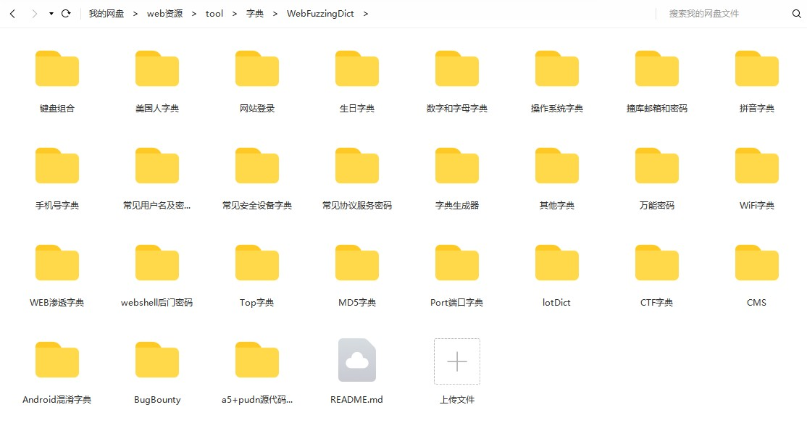
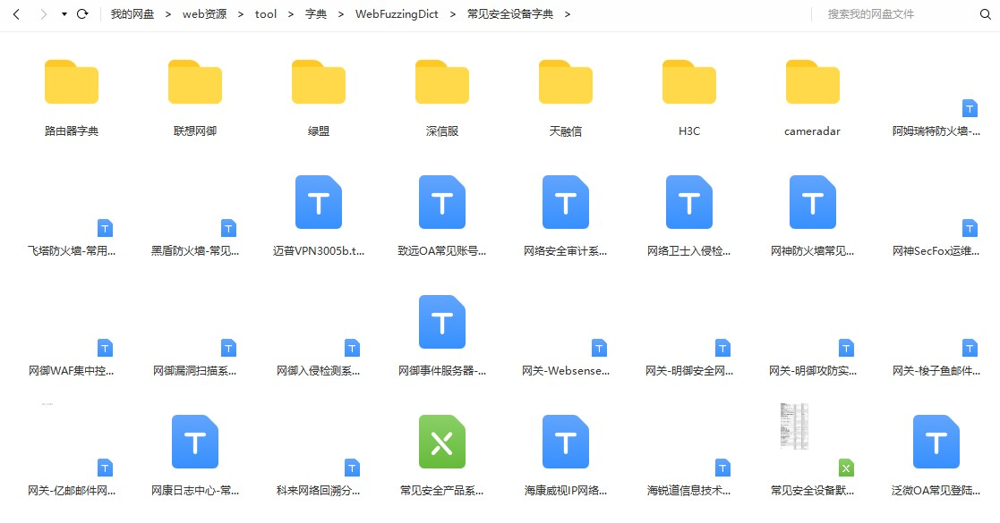

### 前言

渗透测试字典；爆破字典；Web字典；Dict；Fuzzing；

因为文件比较大，将字典文件放到百度云上了，大家自取

- 链接：https://pan.baidu.com/s/105v4uB9hcTv4XIcg7xubyA 
- 提取码：14ei 

### 0x01 整合了常见的字典仓库

- a5+pudn源代码目录103W+
- Android混淆字典
- BugBounty
- CMS
- CTF字典
- lotDict
- MD5字典
- Port端口字典
- Top字典
- webshell后门密码
- WEB渗透字典
- WiFi字典
- 操作系统字典
- 常见安全设备字典
- 常见协议服务密码
- 常见用户名及密码字典
- 键盘组合
- 美国人字典
- 拼音字典
- 其他字典
- 生日字典
- 手机号字典
- 数字和字母字典
- 万能密码
- 网站登录
- 撞库邮箱和密码

### 0x02 常见安全厂商设备字典

### 0x03 各类型Web渗透字典

- API字典
- Burte
- Dir
- DNS字典
- HTTP
- Jsonp
- JS字典
- Param参数字典
- Regex正则字典
- SQL字典
- SSRF字典
- UserAgent字典
- vuls
- Web
- XML字典
- XSS字典
- XXE字典
- 常用攻击Payload
- 控制字符
- 跨目录测试
- 目录路径字典
- 文件包含字典
- 文件上传字典
- 信息探测
- 中间件
- 子域名字典

### 0x03 密码字典管理生成器

- pydictor字典生成管理器
- 白鹿社工字典生成器
- 超级字典生成器
- 社会工程学密码字典生成器
